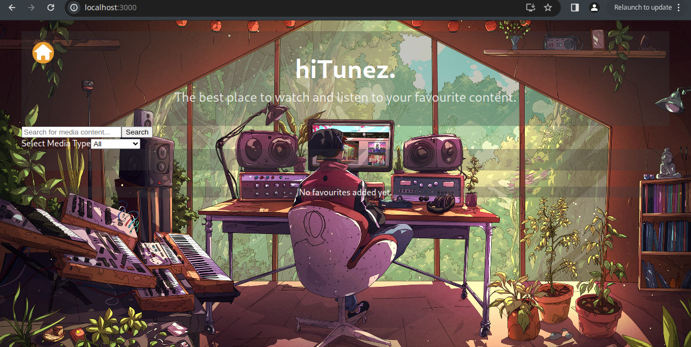

# hiTunez

hiTunez is a web application where users can search for and view their favourite music content. It features a modern interface and allows users to search for songs, view details, and add content to their favourites.



## Table of Contents
- [Project Overview](#project-overview)
- [Frontend](#frontend)
  - [Technologies Used (Frontend)](#technologies-used-frontend)
  - [Running the Frontend](#running-the-frontend)
- [Backend](#backend)
  - [Technologies Used (Backend)](#technologies-used-backend)
  - [Running the Backend](#running-the-backend)
- [API Usage](#api-usage)

---

## Project Overview

hiTunez is split into two main components: the **frontend**, which is responsible for the user interface and experience, and the **backend**, which handles data management, search queries, and content delivery.

### Frontend
The frontend is built using **React** and styled with **Bootstrap** to provide an engaging and interactive user experience. Users can search for media content by artist or track name, view details, and add tracks to their favourites list.

### Backend
The backend handles requests from the frontend, fetches data from external APIs, processes the data, and sends it back to the frontend in a user-friendly format.

---

## Frontend

The frontend of the project is built using **React**, **React Router**, and **Bootstrap**. It makes use of **Axios** to communicate with the backend server for fetching data. The UI allows users to search for music content, display the results, and manage their favourites.

### Technologies Used (Frontend)
- **React**: Frontend framework for building user interfaces.
- **React Router**: Library for routing between different views in the application.
- **Axios**: For making HTTP requests to the backend.
- **Bootstrap / React-Bootstrap**: For styling the UI components.
- **React Icons**: To display icons across the application.

### Running the Frontend

1. Clone the repository:

   ```bash
   git clone https://github.com/Lusanda11/hitunez-media-player
   cd hitunez-media-player/frontend
   ```

2. Install dependencies:

    ```bash
    npm install    
    ```

3. Start the frontend server:

    ```bash
    npm start    
    ```

4. The frontend will now be running on `http://localhost:3000`.


### Important Notes:
- Ensure the backend server is running on `http://localhost:5000` or modify the API endpoint in your frontend accordingly.

---

## Backend

The backend is responsible for fetching and delivering music-related data to the frontend. It communicates with an external music API to retrieve track information based on user input and processes the data before sending it back to the frontend for display.


## Technologies Used (Backend)

- Node.js: Runtime environment to run JavaScript on the server side.
- Express: Web framework for building the backend API.
- Axios: For making requests to external APIs (like music databases).
- Cors: Middleware to enable Cross-Origin Resource Sharing between frontend and backend.

### Running the Backend

1. Clone the repository:

   ```bash
   cd hitunez-media-player/backend
   ```

2. Install dependencies:

    ```bash
    npm install    
    ```

3. Start the backend server:

    ```bash
    npm start Or npm run dev   
    ```

4. The backend will now be running on `http://localhost:5000`.


### API Usage
The backend API exposes several endpoints that the frontend uses to retrieve information:

- /search?term={term}&media={mediaType} - Search for music content by artist or track name.
- /favourites - Manage the user's favourite tracks.

Make sure to update the API endpoints if the server runs on a different port.

---


### hiTunez functionalities


The image below shows music search results on hiTunez.


The image below shows movie search results on hiTunez.


The image below shows software search results on hiTunez.


The image below shows an array of content added in  favourite-list of the user on hiTunez.


---

### Conclusion
By following the above steps, you will be able to run both the frontend and backend servers locally. Once both servers are running, the frontend will interact with the backend to provide users with music or other content search capabilities and the ability to add tracks, movies, softwares etc to their favourites.


### Key points from the `package.json`:

- The frontend uses `React`, `Axios`, `React Router`, `Bootstrap`, and `React-Bootstrap`.
- The `scripts` section includes commands to start (`npm start`), build (`npm build`), and test (`npm test`) the frontend app.

You can adjust the `API Usage` section depending on how you’ve structured your backend.
